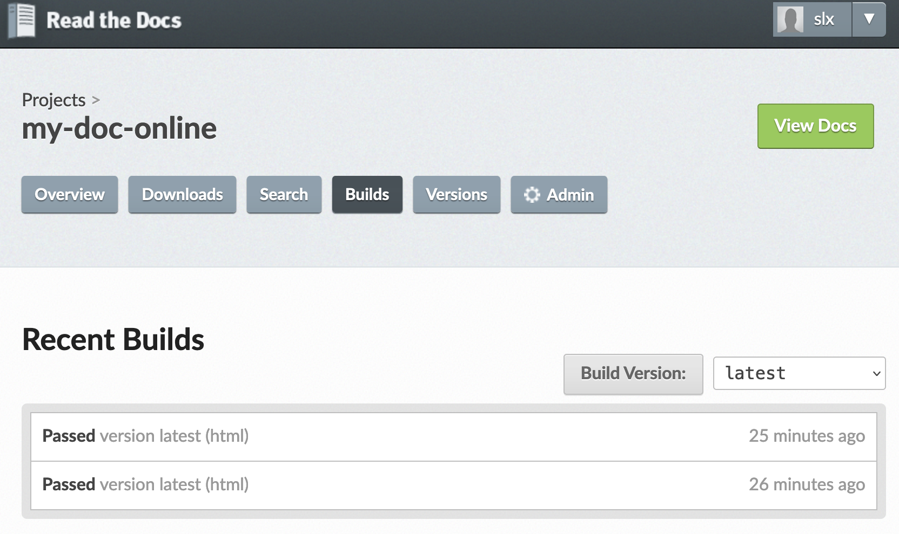

# Build the documentation

This  page explains how to write and publish the documentation of  a code with Reathedocs. 

This tutorial is for the case  you don't wish to share the code itself nor its internal documentation (like the code docstrings) but you only want to publish an external documentation about it.

In case you want to share a documentation _and_ the code itself, and if your code is in Python, documented with nice docstrings, you can have a look at [this other tutorial](https://my-documented-code-test.readthedocs.io/en/latest/) instead.

You'll notice that this tutorial  is itself built using Readthedocs. 

---
## 0. Get ready on github 
As a pre-requisite, you need:
* to have a github account,
* to have created a new github Project, say for example `my-doc-online` ([see here on gihub](https://github.com/stephanieleroux/my-doc-online)),
* this Project contains a source folder where you will put the text files containing the documentation. 

As an example, here is the structure of the `my-doc-online` github project:
```
my-doc-online/
├── LICENSE
├── README.md
├── requirements.txt
└── source
    ├── build_documentation.md
    ├── conf.py
    ├── formatting-tips.md
    ├── access-the-code.rst
    ├── img
    │   └── screenshot-build-doc2.png
    ├── index.rst
    └── introduction.rst
```


---
## 1. Set up your documentation

### 1.1 Add a .readthedoc.yaml config file 
You need to have a `.readthedocs.yaml` config file at the root of your Project (in our dummy example, it will be located in the `/my-doc-online/` directory).

Here is the simple config file used in the example:

```
# .readthedocs.yaml
# Read the Docs configuration file
# See https://docs.readthedocs.io/en/stable/config-file/v2.html for details

# Required
version: 2

# Set the version of Python and other tools you might need
build:
  os: ubuntu-20.04
  tools:
    python: "3.9"
    

# Build documentation in the root directory with Sphinx
sphinx:
   configuration: source/conf.py
   builder: html
   fail_on_warning: true


# Optionally declare the Python requirements required to build your docs
python:
   install:
   - requirements: requirements.txt
```

### 1.2 Add a requirements.txt file 
Add a `requirements.txt` file at the root of your Project. This file indicates the requirements (packages) needed to use build you documentation.

In our example we have:
```
$$>> vi requirements.txt 
sphinx>=4.4.0
myst_parser>=0.15.2
```

### 1.3 Set up your `conf.py` file
This configuration file will set options for Readthedocs to generate the documentation on-line.

In our case we have: 
```
vi source/conf.py 
# Configuration file for the Sphinx documentation builder.
#
# This file only contains a selection of the most common options. For a full
# list see the documentation:
# https://www.sphinx-doc.org/en/master/usage/configuration.html

# -- Path setup --------------------------------------------------------------

# If extensions (or modules to document with autodoc) are in another directory,
# add these directories to sys.path here. If the directory is relative to the
# documentation root, use os.path.abspath to make it absolute, like shown here.
#
#import os
#import sys
#sys.path.append(os.path.abspath('../../dummypackage/'))


# -- Project information -----------------------------------------------------

project = 'my-documented-code-test'
copyright = '2022, stephanie'
author = 'stephanie'

# The full version, including alpha/beta/rc tags
release = '0.0'

master_doc = 'index'

# -- General configuration ---------------------------------------------------

# Add any Sphinx extension module names here, as strings. They can be
# extensions coming with Sphinx (named 'sphinx.ext.*') or your custom
# ones.
#extensions = [
#    'sphinx.ext.autodoc'
#]
extensions = [
    'myst_parser'
]

source_suffix = {
    '.rst': 'restructuredtext',
    '.txt': 'markdown',
    '.md': 'markdown',
}

myst_enable_extensions = ["dollarmath", "amsmath"]

# Add any paths that contain templates here, relative to this directory.
templates_path = ['_templates']

# List of patterns, relative to source directory, that match files and
# directories to ignore when looking for source files.
# This pattern also affects html_static_path and html_extra_path.
exclude_patterns = []


# -- Options for HTML output -------------------------------------------------

# The theme to use for HTML and HTML Help pages.  See the documentation for
# a list of builtin themes.
#
#html_theme = 'classic'
html_theme = 'sphinx_rtd_theme'

# Add any paths that contain custom static files (such as style sheets) here,
# relative to this directory. They are copied after the builtin static files,
# so a file named "default.css" will overwrite the builtin "default.css".
#html_static_path = ['_static']

exclude_patterns = ['_build', 'Thumbs.db', '.DS_Store']
```

* The extension 'myst_parser' and the `source_suffix` list is not necessary but it can be used to switch on markdown format and latex equations within the documentation. `myst_enable_extensions = ["dollarmath", "amsmath"]` is also needed in that case.


### 1.4 Set up the index.rst file
This file is the index of your documentation. You can set which other text files will be included. You can add as many files as you want, in rst format (or in markdown if you have unable this option - see above).
The  pages to include in the documentation are listed in the `toctree::` section. 
In our example, the index file looks like:
```
.. my dummy documentation master file
   You can adapt this file completely to your liking, but it should at least
   contain the root `toctree` directive.

Welcome to my code's documentation!
==============================================

.. toctree::
   :maxdepth: 2
   :caption: Contents:

   introduction
   getting_started
   build_documentation
   formatting-tips

Indices and tables
==================

* :ref:`genindex`
* :ref:`modindex`
* :ref:`search`
```

### 1.5 Write your documentation!
It must be written in [rst format](https://thomas-cokelaer.info/tutorials/sphinx/rest_syntax.html), which is close to markdown format. You can also write in markdown if you have unable this option (see above, and also the "formatting tips" section below).

Each documentation page  you write (each file, in either .rst or .md format) should be referenced to in the index.rst file to be included in the on-line rendered documentation.

Finally, push your up-to-date Project on github.

---
## 2. Getting started on Reathedocs.org

### 2.1 Create your account:
The first thing you then need to do is to create an account on [ReadTheDocs.org](https://readthedocs.org/accounts/signup/). 

There is an [extensive documentation](https://docs.readthedocs.io/en/stable/tutorial/) about what/how you can do with readthedocs. Here we will go through the _basic steps_ to publish an online documentation. Please refer to the above link for more advanced needs.

### 2.2 Connect to your github account
* From your account on Reathedocs, click on __"Connect your Accounts"__,
* Then connect your github account.

### 2.3 Import a Project
* Click on your login on the top right of the readthedocs page, then __"My Projects"__,
* Click on __"Import a Project"__,
* Click on __"Import Manually"__ and fill in the requested fields.


---
## 3. Build your documentation  on-line with readthedocs

To do so, check on the readthedocs `build` page. In our example: [https://readthedocs.org/projects/my-doc-online/builds/](https://readthedocs.org/projects/my-doc-online/builds/).
If you had connected your github Project to your reathedocs account as explained in this tuto, a "webhook" was generated automatically so that any new `push` or 'pull request` on your github project will send a notification to your readthedocs account and will trigger a new build  of your documentation. If for some reason the webhook was not generated, you can set it up manually following these [instructions](https://docs.readthedocs.io/en/stable/connected-accounts.html).

Your screen should look like this:



You can click on the latest build to see the details (and try to debug if it failed).
If it was successful, congrats! You can now access your rendered documentation by clicking on the `view docs` button.


